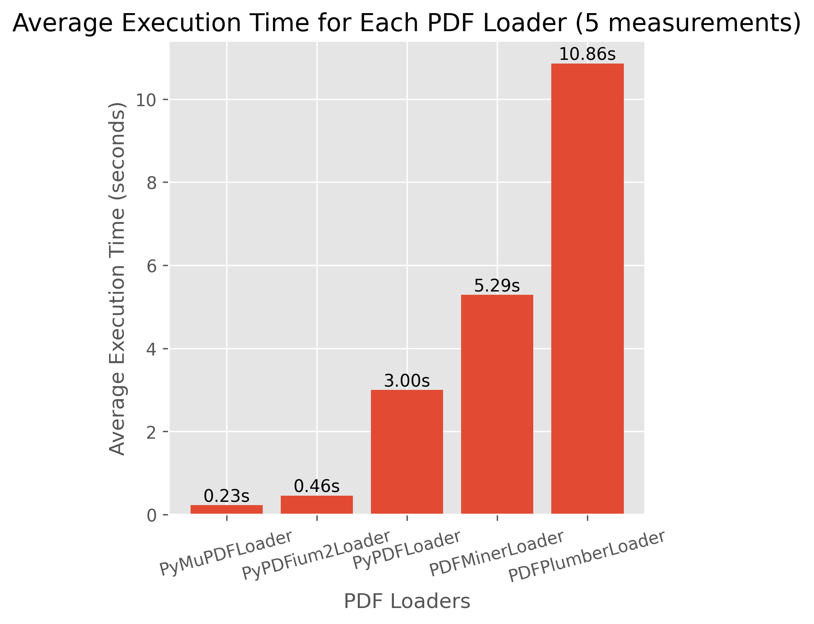

# Glov-RAG

> ## RAG Based Question-Answer System

Glov-rag is a question-answering system based on an pretrained embedding model SentenceTransformer: **BAAI/bge-m3**.
It uses **PGVector** as the vector database, stores splitted document chunks in the database, and allows users to query the database using a question.


https://github.com/user-attachments/assets/74fc9cb7-7ec8-4320-9d6c-28b016a07119


https://github.com/user-attachments/assets/be1b7f3d-9476-4cb6-985a-8830b475c1fb


## Features

- [x] Checks if url is a valid HTTP/HTTPS URL
- [x] Checks if url is a valid PDF URL
- [x] Checks PDF file size, configured to 20MB
- [x] Split PDF into chunks using PyMuPDF, each chunk size is between 80-100 words
- [x] Store splitted chunks in PGVector
- [x] Query PGVector using the query from incoming request
- [x] Logging on each step
- [x] Tests for downloading PDF file and splitting PDF into chunks

# Usage with cURL

This is a small document, yields response approximately in 10-12 seconds.

```bash
curl -X 'POST' \
  'https://glov.kefeli.dev/embed/' \
  -H 'accept: application/json' \
  -H 'Content-Type: application/json' \
  -d '{
  "query": "What are the certifications?",
  "url": "https://d1.awsstatic.com/training-and-certification/docs/AWS_certification_paths.pdf"
}'

# Response:
# {
#   "chunks": [
#     "Here’s what AWS Certification holders have to say:\n“Certifications add credibility and demonstrate my...",
#     "positions you for career \nadvancement and higher pay. \nDo you have 1-3 years of IT or \nSTEM background?...",
#     "Plan your AWS \nCertification Journey\nTRAINING AND CERTIFICATION\nFrom a non-IT background, \nswitching to a cloud career...",
#     "– Associate and I now hold 10 AWS Certification(s). What I learned really changed my\nperspective of what’s ...",
#     "the role(s) you are interested in and get started or continue your AWS Certification journey to achieve your ..."
#   ]
# }
```

```bash
curl -X 'POST' \
  'https://glov.kefeli.dev/embed/' \
  -H 'accept: application/json' \
  -H 'Content-Type: application/json' \
  -d '{
  "query": "Why Self-Attention?",
  "url": "https://proceedings.neurips.cc/paper_files/paper/2017/file/3f5ee243547dee91fbd053c1c4a845aa-Paper.pdf"
}'
# Response:
# {
#   "chunks": [
#     "in the distance between positions, linearly for ConvS2S and logarithmically for ByteNet. This makes\nit more...",
#     "computational complexity, self-attention layers are faster than recurrent layers when the sequence\nlength n is...",
#     "relative positions, since for any fixed offset k, PEpos+k can be represented as a linear function of\nPEpos...",
#     "recurrent layers, by a factor of k. Separable convolutions [6], however, decrease the complexity\nconsiderably...",
#     "and queries come from the same place, in this case, the output of the previous layer in the\nencoder..."
#   ]
# }
```

FIA Rules document is a large document, yields response approximately in 10 minutes.

```bash
curl -X 'POST' \
  'https://glov.kefeli.dev/embed/' \
  -H 'accept: application/json' \
  -H 'Content-Type: application/json' \
  -d '{
  "query": "What are the rules for brakes?",
  "url": "https://www.fia.com/sites/default/files/fia_2024_formula_1_technical_regulations_-_issue_1_-_2023-04-25.pdf"
}'
# Response:
# {
#   "chunks": [
#     "11.1.2 The brake system must be designed so that within each circuit, the forces applied to the...",
#     "11.2.2 All brake calipers must be made from aluminium materials with a modulus of elasticity no...",
#     "2024 Formula 1 Technical Regulations \n92 \n25 April 2023 \n© 2023 Fédération Internationale de...",
#     "11.3.2 All discs must have a maximum thickness of 32mm \n11.3.3 \nThe diameters of the discs are...",
#     "made by the driver's direct physical input or by the system referred to in Article 11.6, and..."
#   ]
# }
```

## Further Improvements

These are the improvements that can be done in the future; some of them are open to discussion and may vary based on the requirements.

- **Cache PDF files for consecutive requests, to avoid downloading the same file multiple times.**

  Caching the file submitted by the user can significantly reduce unnecessary downloads and improve performance. However, since there is no authentication mechanism in place, caching could introduce security risks, as it may expose sensitive information to unauthorized users.

- **Implement table extraction and image extraction from PDF files, to improve the quality of the extracted text.**

  Enhancing the extraction process by including table and image extraction will lead to more comprehensive and accurate results, especially when dealing with complex documents.

- **Accept pdf files from S3, Google Drive, and other cloud storage services.**

  Extending the system to accept PDF files from cloud storage services can provide more flexibility and convenience to users, allowing them to upload files from various sources.

- **Rate limit the incoming requests, to avoid abuse of the system.**

  Implementing a rate limit can help protect the system from being overwhelmed by excessive requests, potentially causing service disruptions. This can be achieved using FastAPI's rate limit middleware, which can efficiently manage and throttle incoming requests based on predefined limits.

- **Some constants are hard-coded, which can be moved to configuration files for better maintainability.**

  Constants such as the maximum file size, chunk size, and other configuration parameters can be moved to a configuration file, making it easier to manage and update these values without modifying the code.

## Installation

```bash
poetry install --with dev,test
```

## Usage (Local)

```bash
fastapi dev glov/app.py
```

## Build Docker Image

```bash
docker build -f docker/Dockerfile -t glov-rag .
```

## Run Docker Compose

```bash
docker compose -f docker/docker-compose.yml up -d
```

# Development

This project uses [Poetry](https://python-poetry.org/) for dependency management and packaging.
All commits follow the [Conventional Commits](https://www.conventionalcommits.org/en/v1.0.0/) specification.

Linting and formatting available using [pre-commit](https://pre-commit.com/).

To lint the code:

```bash
poe lint
```

Linting uses [ruff](https://github.com/astral-sh/ruff) and [mypy](https://mypy-lang.org/) for type checking.

To run tests:

```bash
poe test
```

## Why I Have Chosen PyMuPDFLoader?

I have benchmarked few PDF loaders from langchain with an example [PDF File (2.2MB 177 pages)](assets/FIA_2024_Formula_1_Technical_Regulations.pdf).

## The loaders are:

- PDFMinerLoader
- PyPDFLoader
- PyMuPDFLoader
- PDFPlumberLoader
- PyPDFium2Loader

I have chosen PyMuPDFLoader because it is the fastest among all the loaders.


